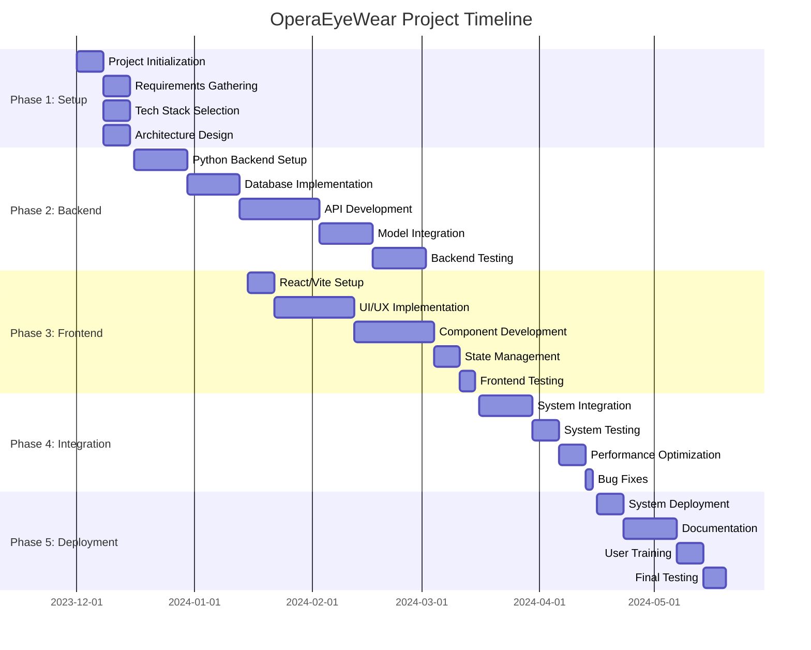

# OperaEyeWear Project Gantt Chart
December 2023 - May 20, 2024

## Project Timeline

### Phase 1: Project Setup and Planning (Dec 1 - Dec 15)
- [x] Project initialization
- [x] Requirements gathering
- [x] Technology stack selection
- [x] Project architecture design

### Phase 2: Backend Development (Dec 16 - Feb 15)
- [x] Python backend setup
- [x] Database design and implementation
- [x] API development
- [x] Sunglasses detection model integration
- [x] Backend testing and optimization

### Phase 3: Frontend Development (Jan 15 - Mar 15)
- [x] React/Vite project setup
- [x] UI/UX design implementation
- [x] Component development
- [x] State management implementation
- [x] Frontend testing

### Phase 4: Integration and Testing (Mar 16 - Apr 15)
- [x] Frontend-Backend integration
- [x] System testing
- [x] Performance optimization
- [x] Bug fixes and improvements

### Phase 5: Deployment and Documentation (Apr 16 - May 20)
- [x] System deployment
- [x] Documentation completion
- [x] User training
- [x] Final testing and bug fixes
- [x] Project handover

## Gantt Chart Visualization

## Notes
- The timeline shows overlapping phases to maximize efficiency
- Frontend development started while backend was in progress
- Integration phase began after major components were completed
- Final phase focused on deployment, documentation, and handover
- Project completed on May 20, 2024 as scheduled 